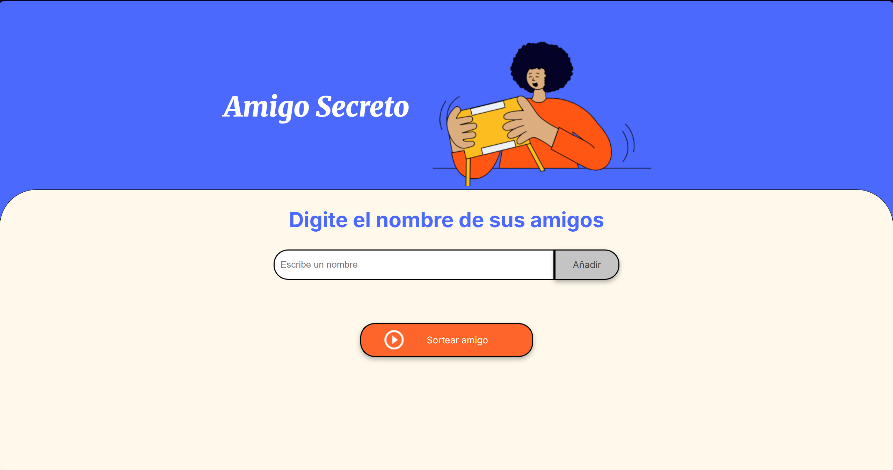
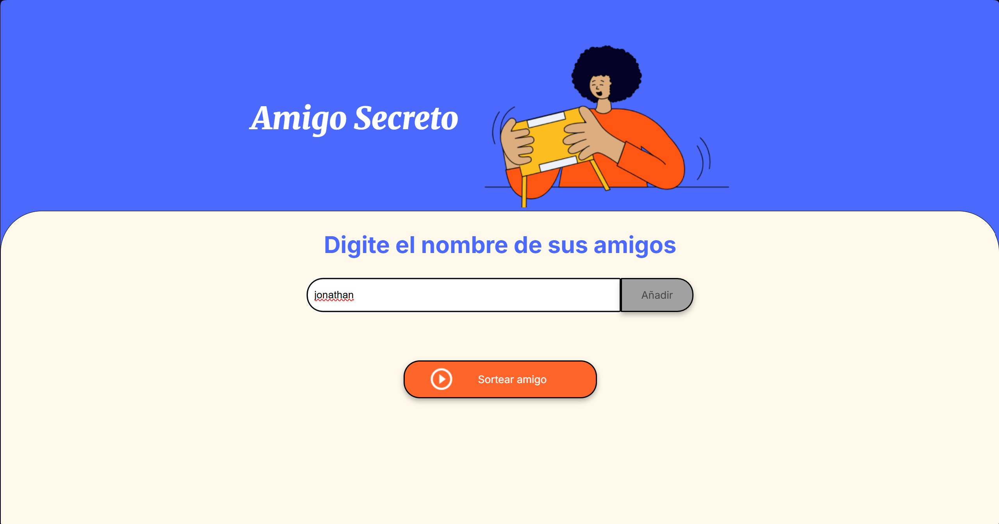
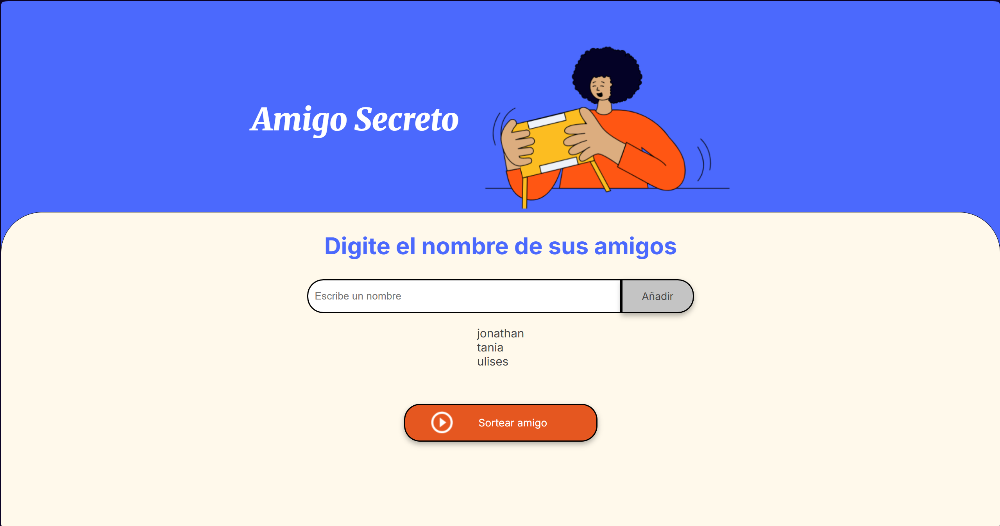
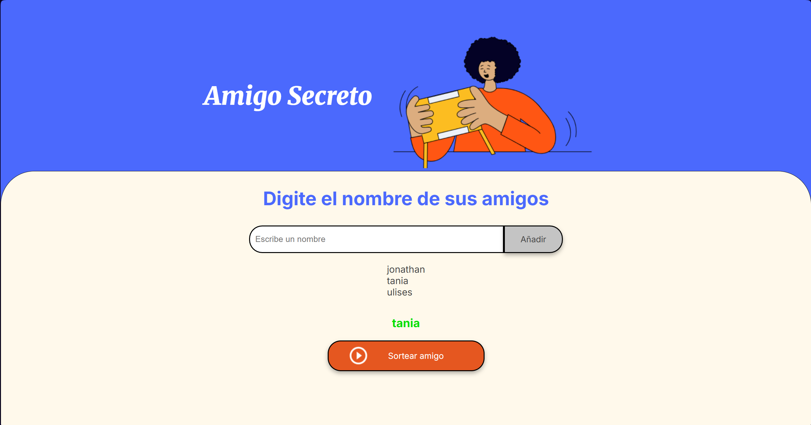
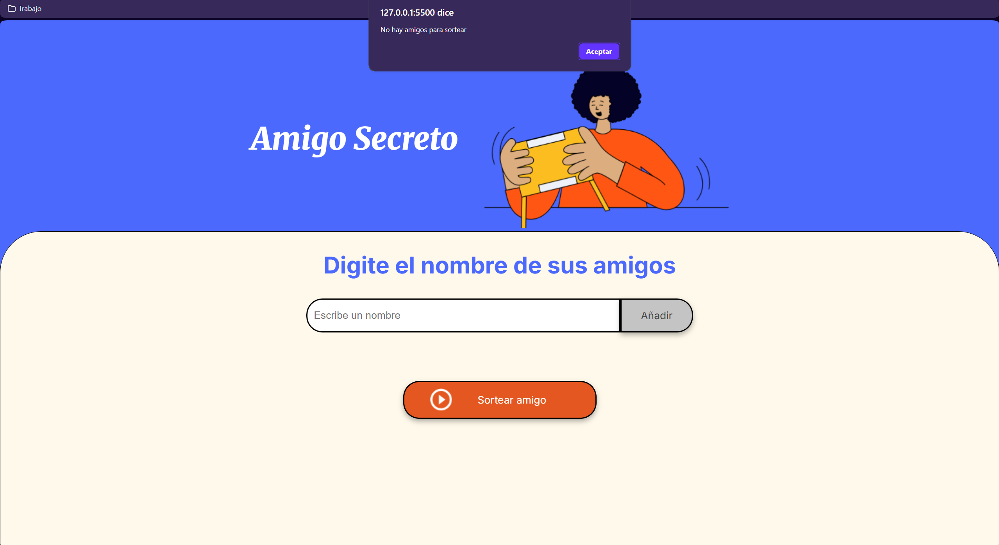

# Sorteador de Amigo Secreto

## Descripción
Aplicación web simple para ingresar nombres de amigos y sortear uno al azar como "amigo secreto". Funciona 100% en el navegador, sin dependencias ni compilación.

## Instalación

1) Obtén el proyecto:
	 - Opción A: descarga el ZIP desde GitHub y descomprímelo.
	 - Opción B (git):
		 ```powershell
		 git clone https://github.com/Joulxd/sorteador-amigo-secreto.git
		 cd sorteador-amigo-secreto
		 ```
2) Abre la carpeta del proyecto en Visual Studio Code.
3) Instala la extensión "Live Server" (si no la tienes).
4) Abre `index.html` y haz clic en "Go Live" (o clic derecho → "Open with Live Server").

Listo: el navegador se abrirá (ej. `http://127.0.0.1:5500`) y se recargará automáticamente al guardar.


## Uso
1) Inicio: vista al abrir el proyecto.
   
	

2) Agregar nombre: escribe un nombre en el campo.
   
	

3) Ver lista: los nombres agregados aparecen en la lista.
   
	

4) Error por nombre vacío: si intentas añadir sin escribir, aparece una alerta.
   
	

5) Sortear: haz clic en "Sortear Amigo" para elegir uno al azar.
   
	

6) Error por sorteo con lista vacía: si no hay nombres, aparece una alerta.
   
	

## Funcionalidades
- Agregar nombres a una lista visible.
- Validación de campo vacío con alerta.
- Sorteo aleatorio y visualización del ganador.
- Validación de sorteo vacío con alerta.

## Tecnologías
- HTML5, CSS3, JavaScript
